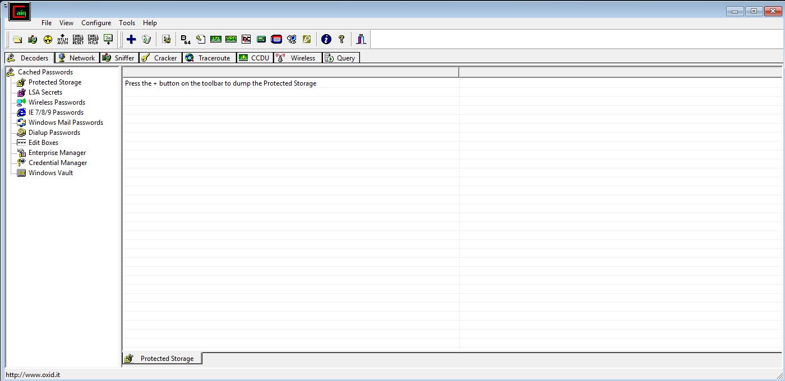

## Cain

## Installation

Required [Winpacp.org](https://www.winpcap.org/install/bin/WinPcap_4_1_3.exe)

{}

Network adapter > IPv4 properties > Advanced > DNS > Enable 'Use this connection's DNS suffix in DNS registration'

## Usage

```plain
1. Start Cain as Admin
2. Start Sniffer - then right click on the white field select 'Scan MAC Addresses'
3. Go to tab APR - then click the + and add the targeted IP's (prefered the router)
4. Click the yellow nuke button to start
```

## Examples


