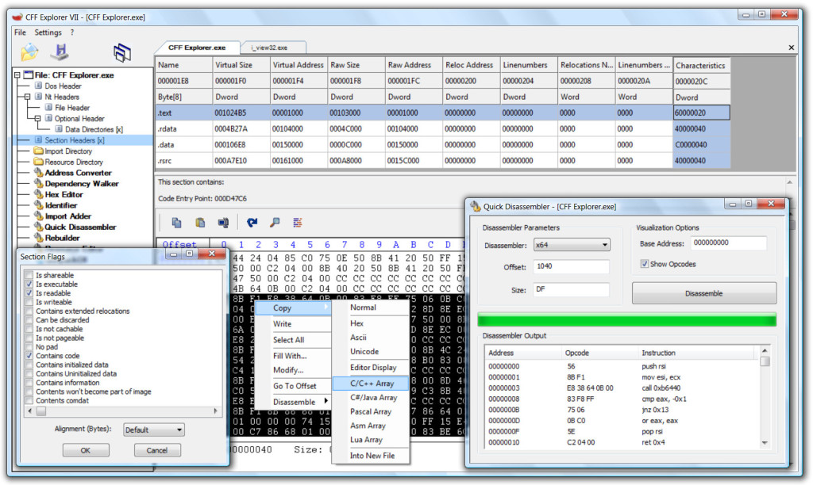
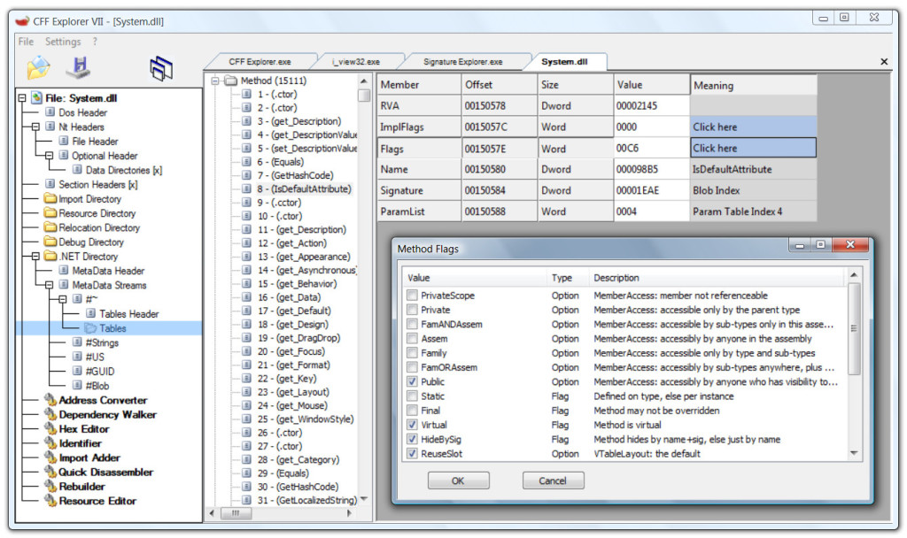

## CFF Explorer

CFF Explorer was designed to make PE editing as easy as possible, but without losing sight on the portable executable's internal structure. This application includes a series of tools which might help not only reverse engineers but also programmers. It offers a multi-file environment and a switchable interface.

## Installation

{}

### Guide

{}

## Examples

## URL List

- [ntcore.com - explorer suite](https://ntcore.com/?page_id=388)
