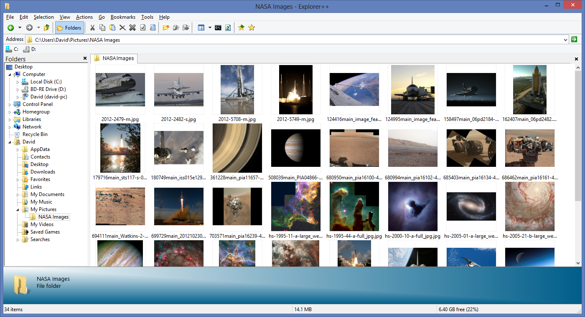
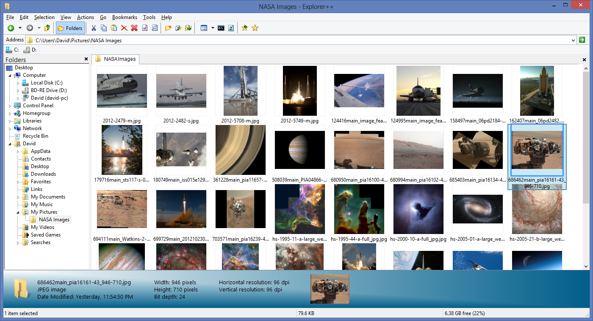
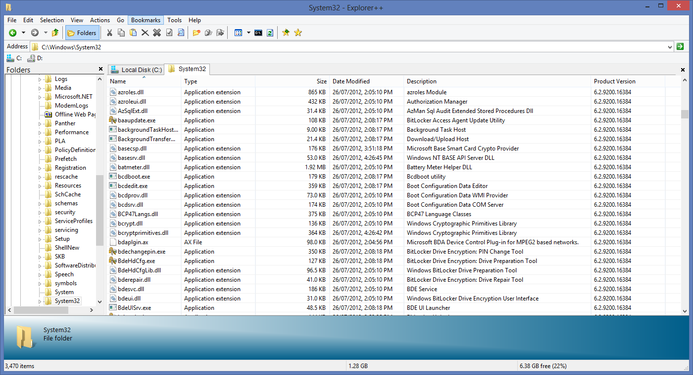
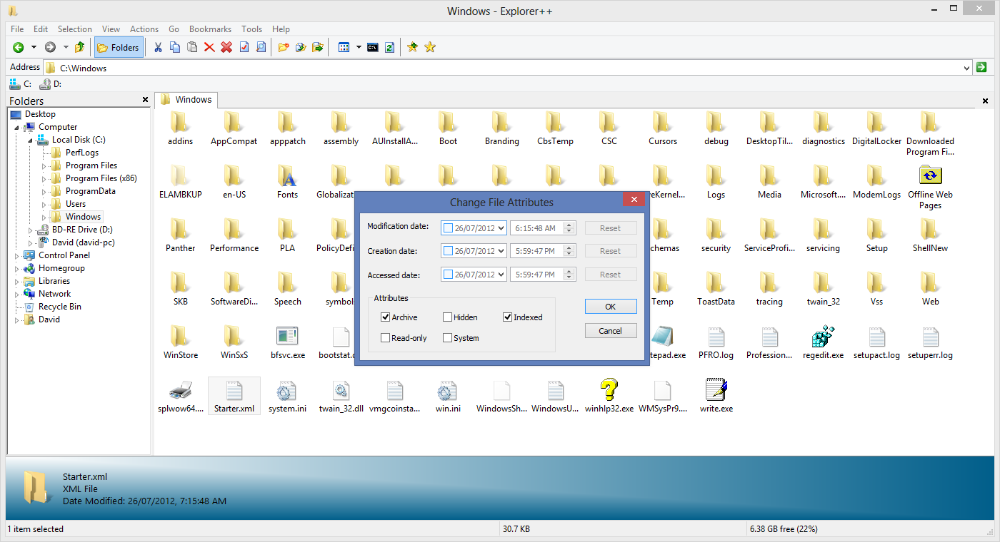
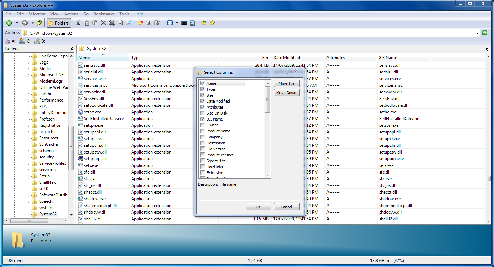
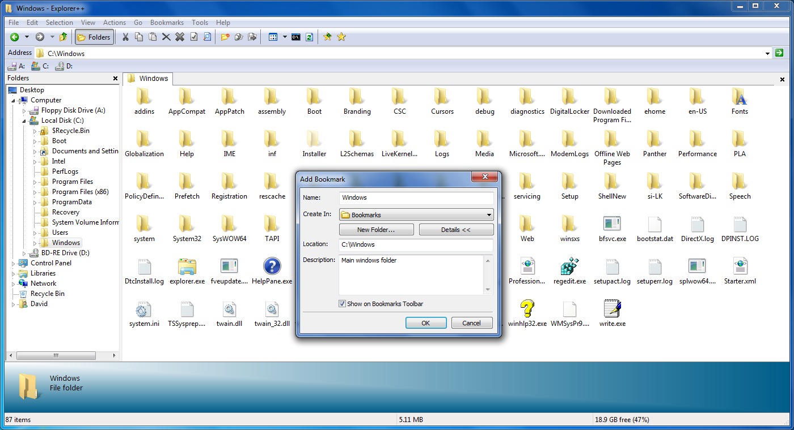
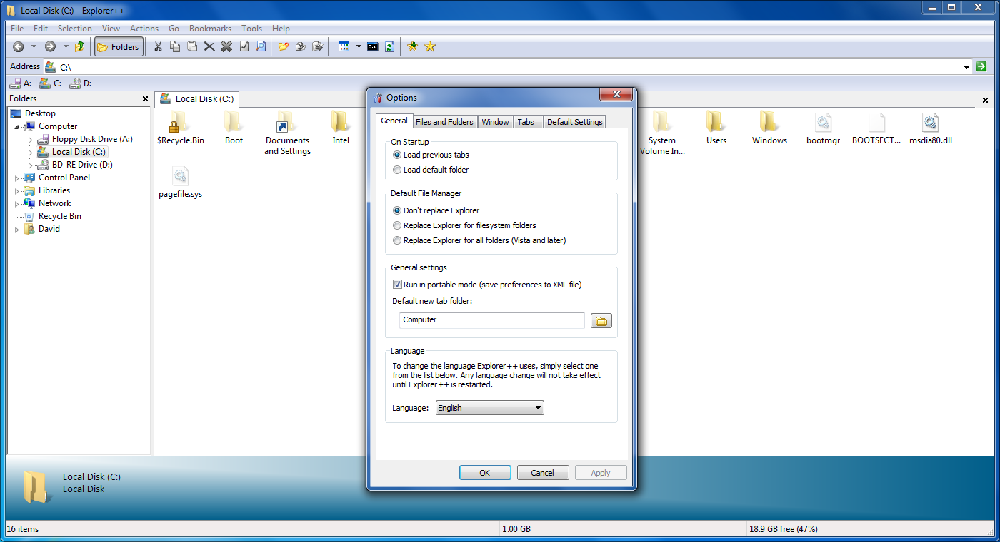
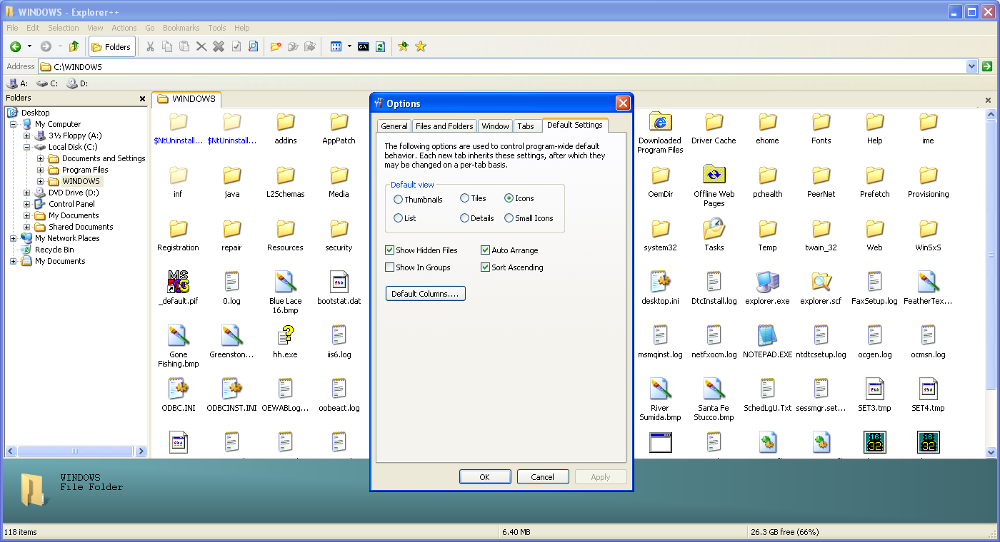

## Explorer++

Is a small and fast file manager for Windows. With tabs, bookmarks and advanced file operations, it allows you to be much more productive!

### Installation

{}

Or download newest release from [Github.com](https://github.com/derceg/explorerplusplus/releases)

### Examples

### URL list

* [Explorerplusplus.com](https://explorerplusplus.com/)
* [Github.com - Explorer++](https://github.com/derceg/explorerplusplus)
