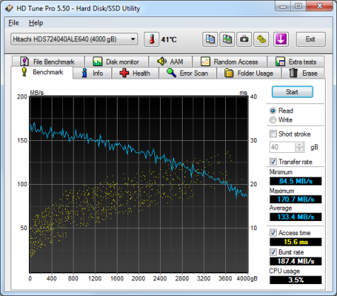
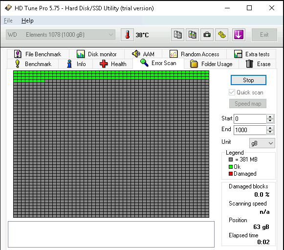
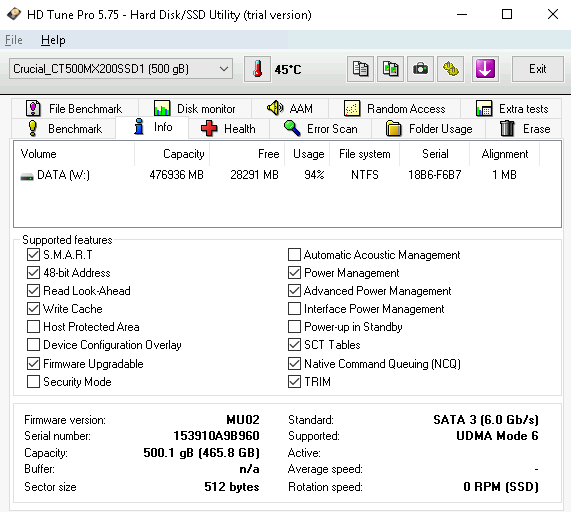

## HD Tune (Pro)

HD Tune (Pro) is a hard disk / SSD utility with many functions. It can be used to measure the drive's performance, scan for errors, check the health status (S.M.A.R.T.), securely erase all data and much more.

### Installation

{}

### Examples

### URL list

* [HDTune.com](https://www.hdtune.com/)
