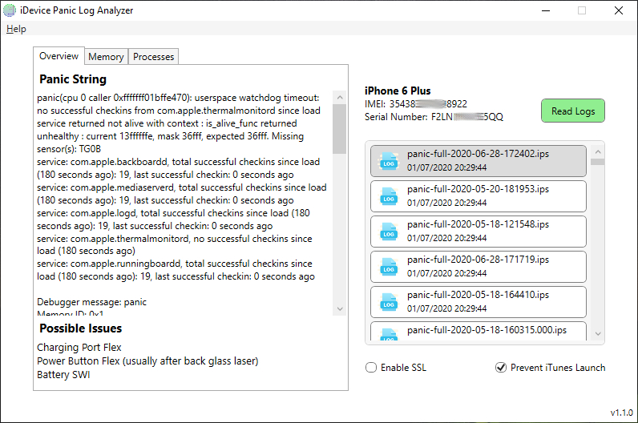

## iDevice Panic Log Analyzer

A quick and easy panic log extraction and analysis tool for iDevices.

Officially supported are all iPhones, iPads and iPod touch on iOS 12 and later. I have successfully tested this as low as iOS 10.3.3, but there are no guarantees it will work as expected.

## Installation

Download newest release from [Github.com](https://github.com/waynebonc/iDeviceLogAnalyzer-public/releases)

## Examples

## URL List

- [Github.com - iDevice Panic Log Analyzer](https://github.com/waynebonc/iDeviceLogAnalyzer-public)
