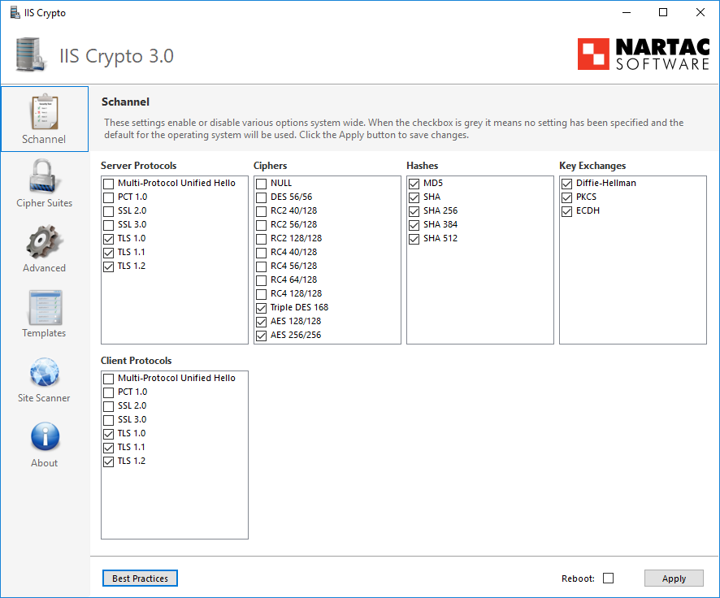

## IIS-crypto

A free tool that gives administrators the ability to enable or disable protocols, ciphers, hashes and key exchange algorithms on Windows Server 2008, 2012, 2016 and 2019.

## Installation

Download newest release from [nartac.com](https://www.nartac.com/Products/IISCrypto/Download)

## Examples

## URL List

* [Nartac.com - IISCrypto](https://www.nartac.com/Products/IISCrypto/)
