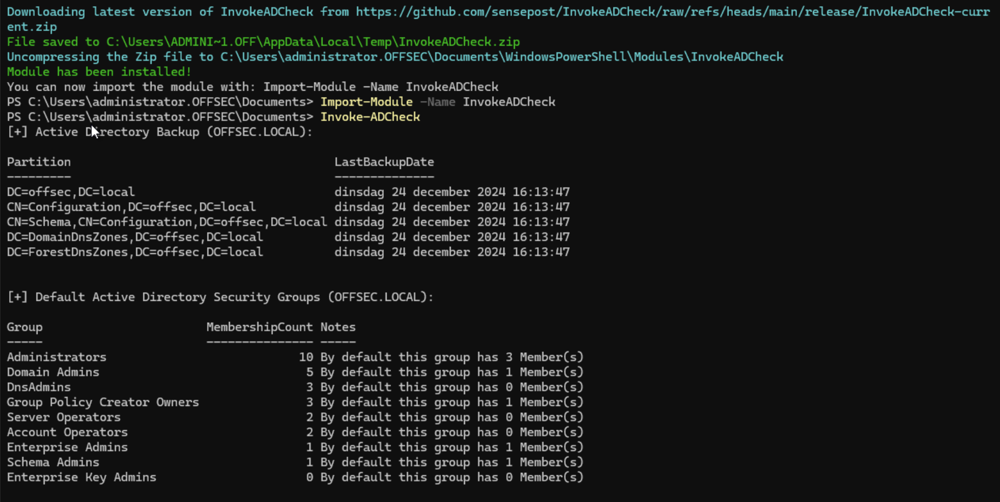

---

InvokeADCheck is a PowerShell module designed to streamline the assessment of Active Directory (AD) environments.
It performs various checks to identify potential security misconfigurations, weaknesses, and adherence to best practices.
By running targeted checks through the PowerShell CLI, this module provides detailed results and actionable insights. It equips IT administrators and security professionals with the means to proactively identify and address potential security risks in AD environments.

**Note:** InvokeADCheck is primarily intended for use in smaller Active Directory domains within a single AD forest. This module is provided "as-is" with no support or guarantees.

## Requirements

To use InvokeADCheck, ensure the following prerequisites are met:

- PowerShell Version 5.0 (or later)
- Windows 10 or Windows 2016 (or newer)
- PowerShell Active Directory Module

Optional:

- PowerShell Group Policy Module

## Installation

To install the module directly, run the following PowerShell command:

```PowerShell
iex(New-Object Net.WebClient).DownloadString("https://raw.githubusercontent.com/sensepost/InvokeADCheck/refs/heads/main/Install.ps1")

Import-Module .\InvokeADCheck.psm1
```

Alternatively, clone the repository to your machine, navigate to the `\InvokeADCheck\releases\InvokeADCheck` directory, and import the module into your session for testing without installation:

```PowerShell
Import-Module .\InvokeADCheck.psm1
```

## Usage

### Run all checks and output results to the console

```PowerShell
PS C:\> Invoke-ADCheck
```

### Run specific checks and output results to the console and a JSON file

```PowerShell
PS C:\> Invoke-ADCheck -Checks ADBackupStatus, DomainController -OutputTypes CLI, JSON -OutputPath C:\Temp
```

### Run all checks and output results to both the console and an Excel file

```PowerShell
PS C:\> Invoke-ADCheck -OutputTypes CLI, XLSX -OutputPath C:\Temp
```

### Run all checks with a specific domain controller and credentials

```PowerShell
PS C:\> Invoke-ADCheck -OutputTypes CLI -Server "ad.domain.tld" -Credential (Get-Credential)
```

## Featured Checks

| Check                   | Description                                                                                |
|-------------------------|--------------------------------------------------------------------------------------------|
| All                     | Run all available checks                                                                  |
| ADBackupStatus          | Retrieve the status of Active Directory backups                                           |
| BuiltInGroupMembership  | Retrieve the membership of built-in Active Directory groups                               |
| DefaultAdministrator    | Retrieve the default Administrator account settings                                       |
| DefaultDomainPasswordPolicy | Retrieve the default domain password policy                                           |
| DomainController        | Retrieve information about domain controllers                                             |
| DomainTrust             | Retrieve domain trust relationships                                                       |
| FunctionalLevel         | Retrieve the domain and forest functional levels                                          |
| GPO                     | Retrieve Group Policy Objects (GPOs)                                                      |
| GPOPermission           | Retrieve permissions on Group Policy Objects                                              |
| GPPPassword             | Retrieve Group Policy Preferences (GPP) passwords                                         |
| GuestAccount            | Retrieve the status of Active Directory guest accounts                                    |
| KerberosDelegation      | Retrieve Kerberos delegation settings for accounts                                        |
| KerberosEncryptionType  | Retrieve the Kerberos encryption types used in the domain                                 |
| KerberosServiceAccount  | Retrieve information about the built-in KRBTGT account                                    |
| MachineQuota            | Retrieve the `ms-DS-MachineAccountQuota` attribute                                        |
| ProtectedUsersGroup     | Retrieve information on the Protected Users group                                         |
| RootACL                 | Retrieve interesting Access Control Entries (ACEs) from the domain root ACL (experimental)|
| TombstoneLifetime       | Retrieve the Active Directory tombstone lifetime attribute                                |
| UserAccountHealth       | Checks the health of Active Directory user accounts                                       |

## Examples



## URL list

- [Github.com - Invoke-ADCheck](https://github.com/sensepost/InvokeADCheck)
