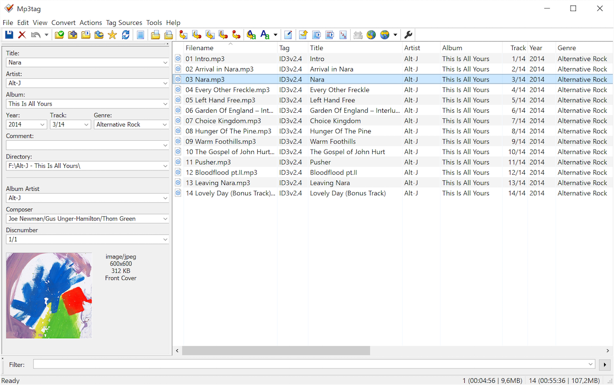

## Mp3tag

Is a powerful and easy-to-use tool to edit metadata of audio files.

It supports batch tag-editing of ID3v1, ID3v2.3, ID3v2.4, iTunes MP4, WMA, Vorbis Comments and APE Tags for multiple files at once.

* Supported audio formats are MP3, MP4, M4A, M4V, FLAC, WAV, WMA, Ogg Vorbis, Opus, Musepack, ALAC and more.
* Online database lookups via Discogs, MusicBrainz or freedb, allowing you to automatically gather proper tags and download cover art for your music library.
* Rename files based on the tag information, replace characters or words in tags and filenames, import/export tag information, create playlists and more.

## Installation

{}

Download newest release from [mp3tag.de](https://www.mp3tag.de/en/download.html) or install with [Microsoft Store](https://www.microsoft.com/en-us/p/mp3tag/9nn77tcq1nc8).

## Examples

## URL List

* [MP3tag.de](https://www.mp3tag.de/en/index.html)
