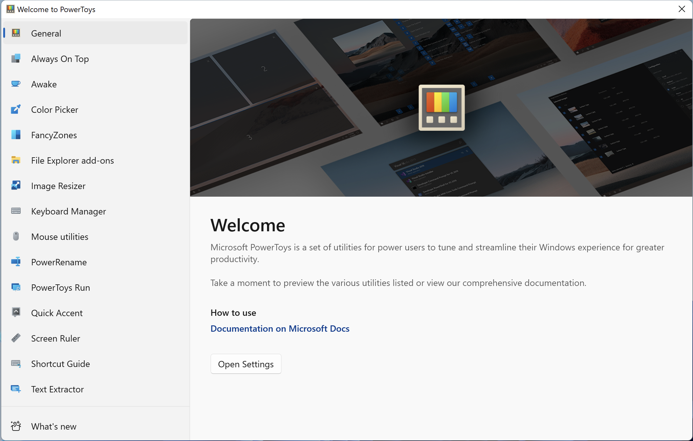
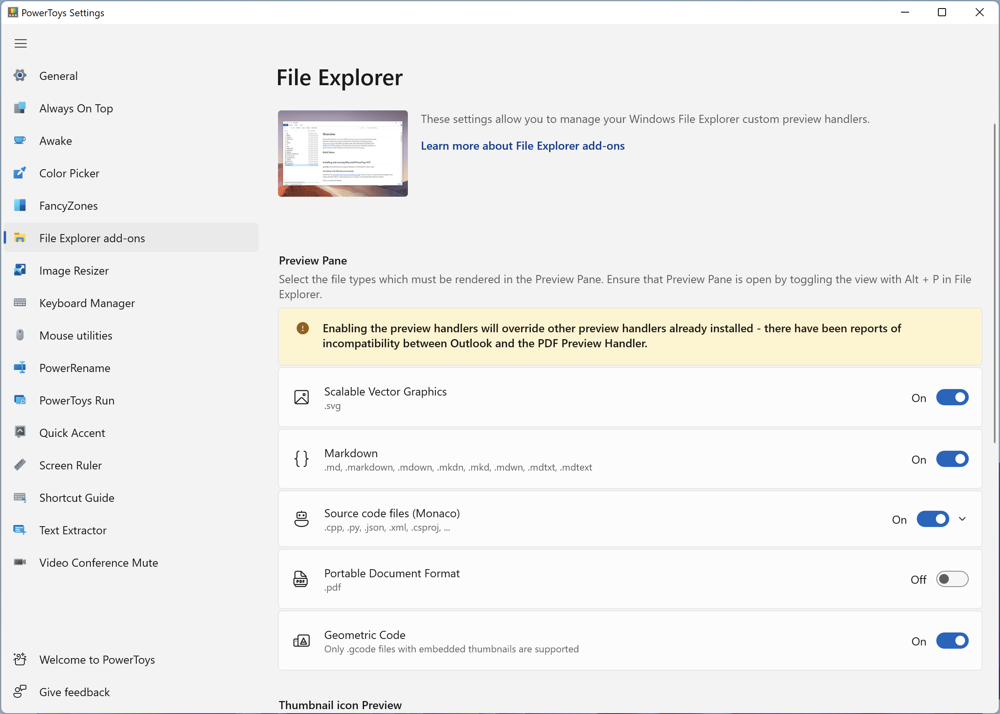

## PowerToys

Microsoft PowerToys is a set of utilities for power users to tune and streamline their Windows experience for greater productivity. For more info on [PowerToys overviews and how to use the utilities](https://aka.ms/powertoys-docs), or any other tools and resources for [Windows development environments](https://learn.microsoft.com/windows/dev-environment/overview), head over to [learn.microsoft.com](https://aka.ms/powertoys-docs)!

### Installation

Install via [Microsoft Store](https://apps.microsoft.com/store/detail/microsoft-powertoys/XP89DCGQ3K6VLD).

OR

Download newest release from [Github.com](https://github.com/microsoft/PowerToys/releases).

### Usage

Please read full capabilities at [learn.microsoft.com](https://learn.microsoft.com/en-us/windows/powertoys/)

### Examples

### URL list

* [learn.microsoft.com - PowerToys](https://learn.microsoft.com/en-us/windows/powertoys/)
* [Github.com - PowerToys](https://github.com/microsoft/PowerToys)
