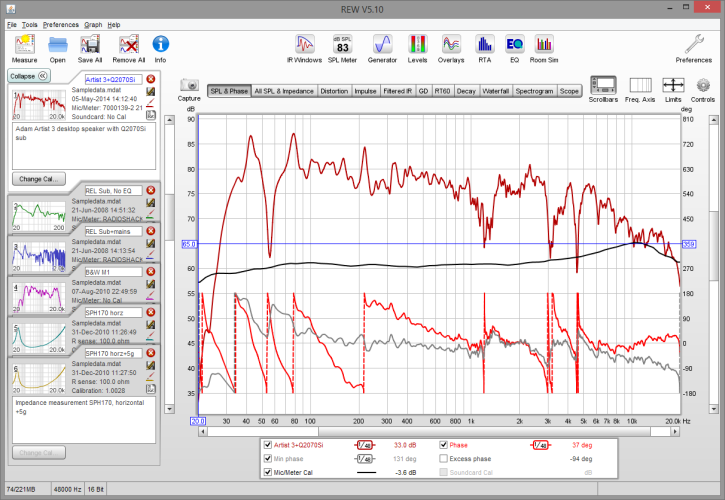
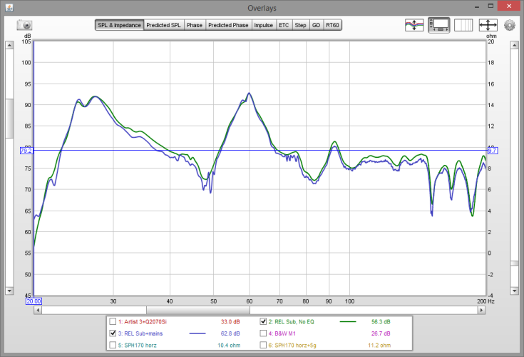
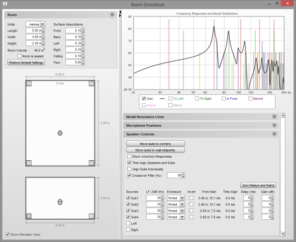
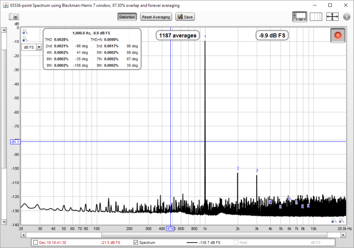
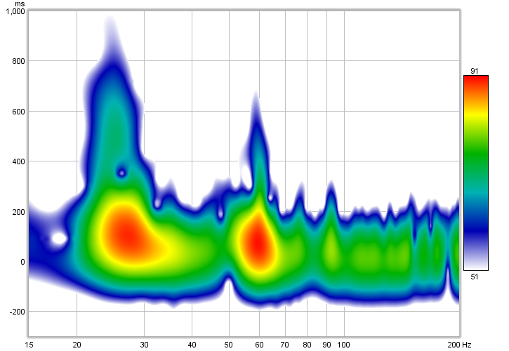
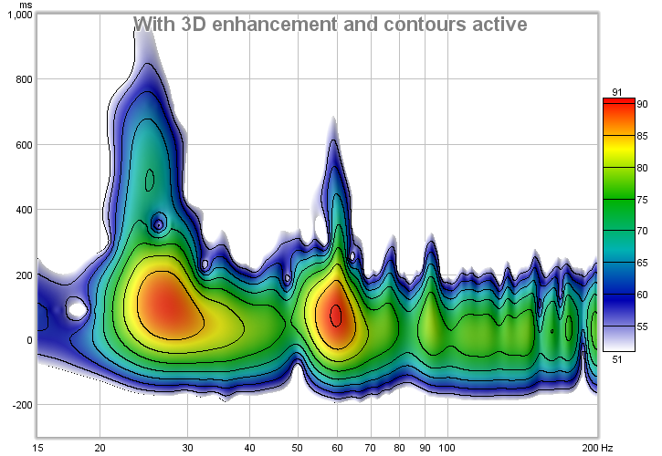
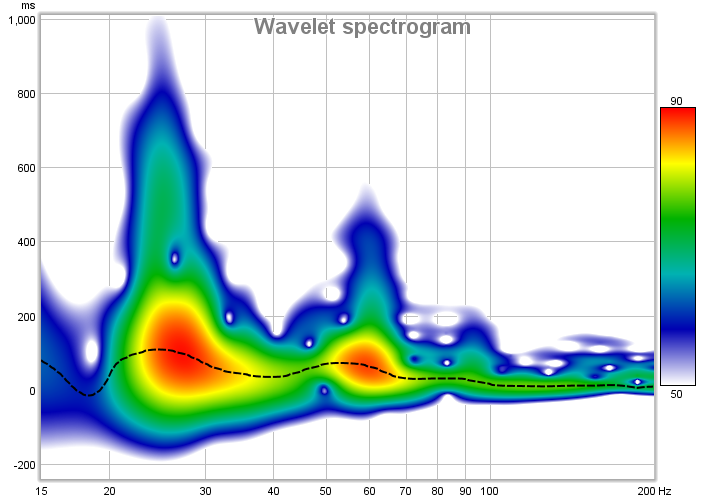

## Room EQ Wizard

REW is free room acoustics and audio device measurement and analysis software for room, loudspeaker and device responses. The audio measurement and analysis features of REW help you optimise the acoustics of your listening room, studio or home theater and find the best locations for your speakers, subwoofers and listening position. It includes tools for generating audio test signals; measuring SPL and impedance; measuring frequency and impulse responses; measuring distortion; generating phase, group delay and spectral decay plots, waterfalls, spectrograms and energy-time curves; generating real time analyser (RTA) plots; calculating reverberation times; calculating Thiele-Small parameters; determining the frequencies and decay times of modal resonances; displaying equalizer responses and automatically adjusting the settings of parametric equalizers to counter the effects of room modes and adjust responses to match a target curve.

## Installation

Windows installer with JRE (32.8MB, includes private Java 8 runtime) / *Recommended for most Windows users*

Download installation from [RoomEQwizard.com](https://www.roomeqwizard.com/)

## Examples

## URL List

- [RoomEQwizard.com](https://www.roomeqwizard.com/)
- [Avnirvana.com - Official Room EQ Wizard Forum](https://www.avnirvana.com/forums/official-rew-room-eq-wizard-support-forum.10/)
