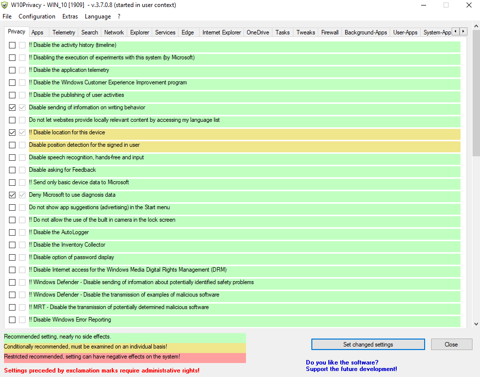
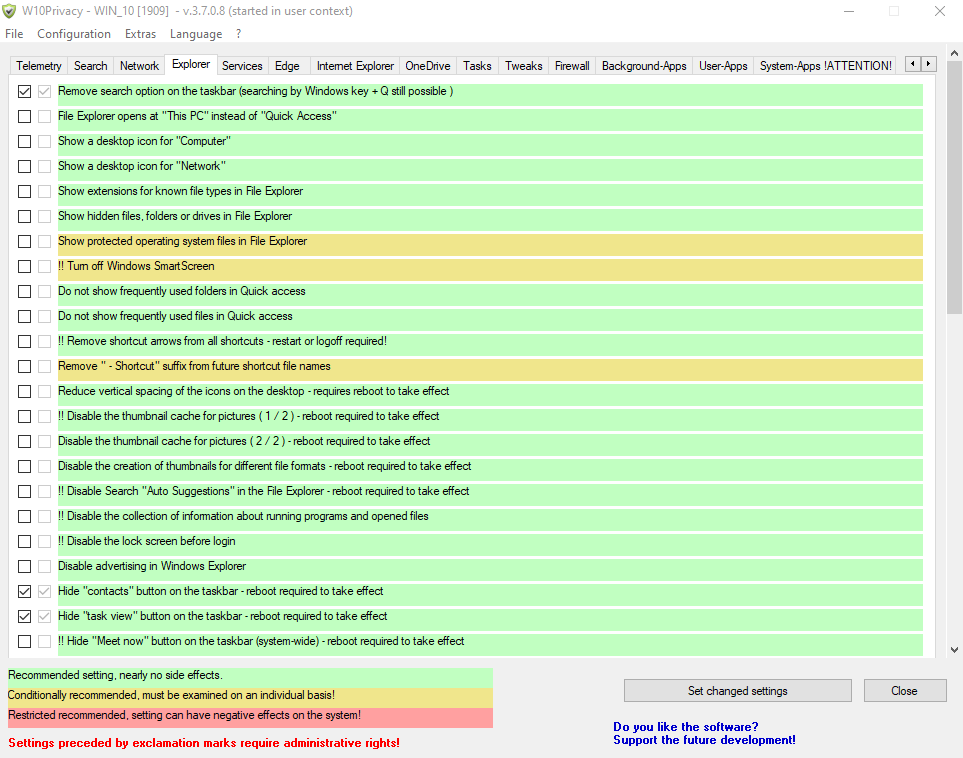

## W10privacy

"Privacy made ​​easy"

The by default highly questionable set options concerning privacy and data protection in Windows 10 brought me to the idea to develop this program. Microsoft generously enableseverybody to change the concerning settings, but hides them in countless menus, where a normal user does not want to search for!

## Installation

Download newest release from [W10Privacy.de](https://www.w10privacy.de/english-home/)

{}

## Examples

## URL List

- [W10privacy.de - Home](https://www.w10privacy.de/english-home/)
