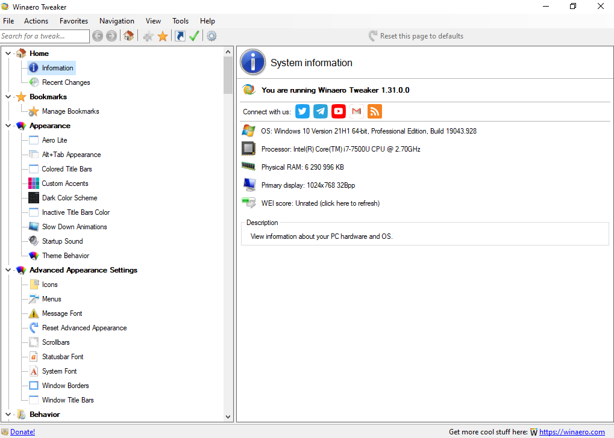
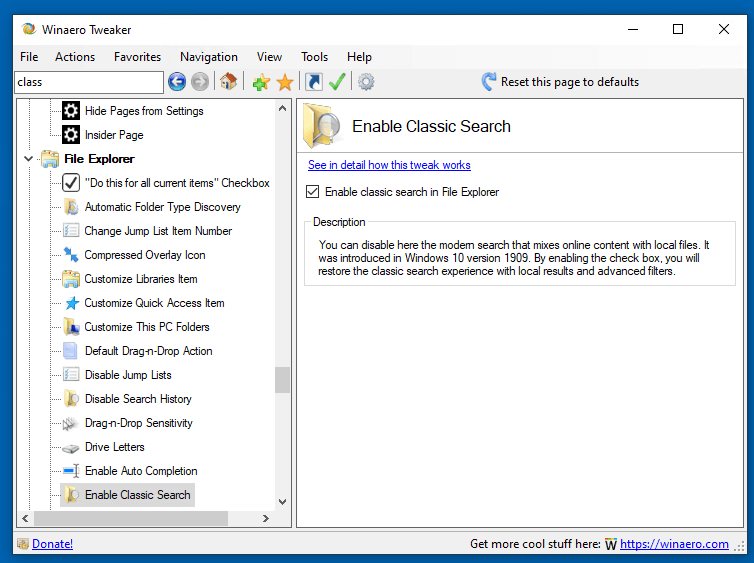
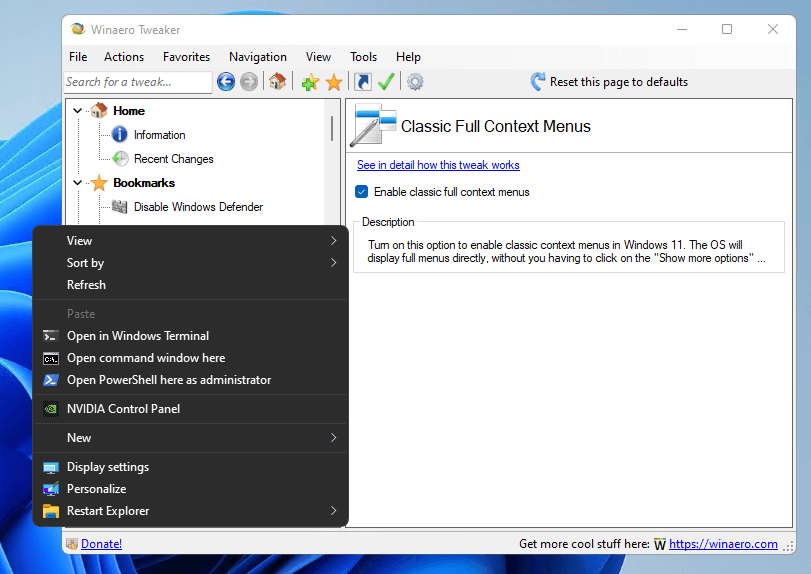

## Winaero Tweaker

After years of development, I decided to release an all-in-one application which will include most options available in my free Winaero apps and extend it as much as possible. I would like to introduce Winaero Tweaker - universal tweaker software which supports Windows 7, Windows 8, Windows 8.1, Windows 10, and Windows 11.

### Installation

Download newest release from [Winaero.com](https://winaero.com/winaero-tweaker/).

{}

### Examples

### URL list

* [Winaero.com](https://winaero.com/)
* [Winaero.com - WinaeroTweaker](https://winaero.com/winaero-tweaker/)
