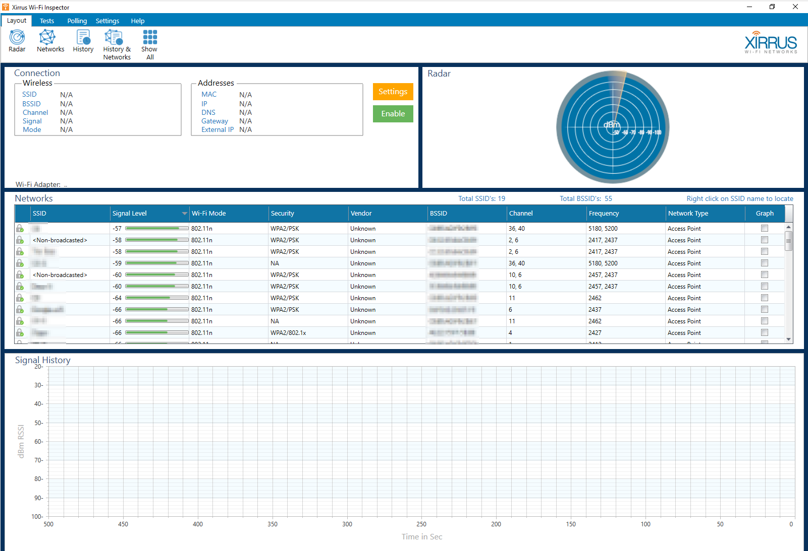
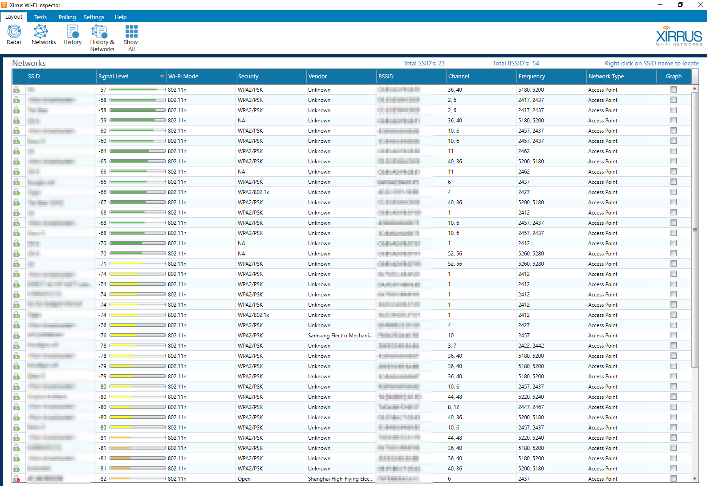

## Xirrus Wi-Fi Inspector

Xirrus Wi-Fi Inspector is special software that allows users to find the various Wi-Fi hotspots in their area and get connected quickly and conveniently. The software also helps to troubleshoot connection problems so that users can make sure they are always connected to the net when they need to be.

## Installation

{}

## Examples

## URL List

- [Xirrus.com - Inspector](https://www.xirrus.com/inspector)
